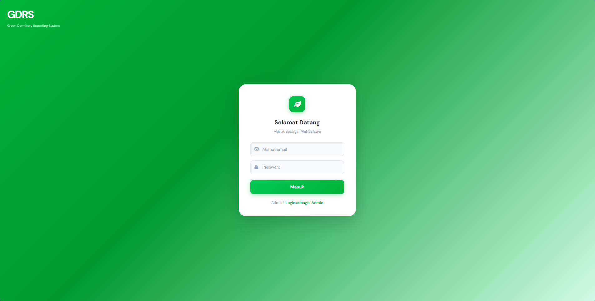
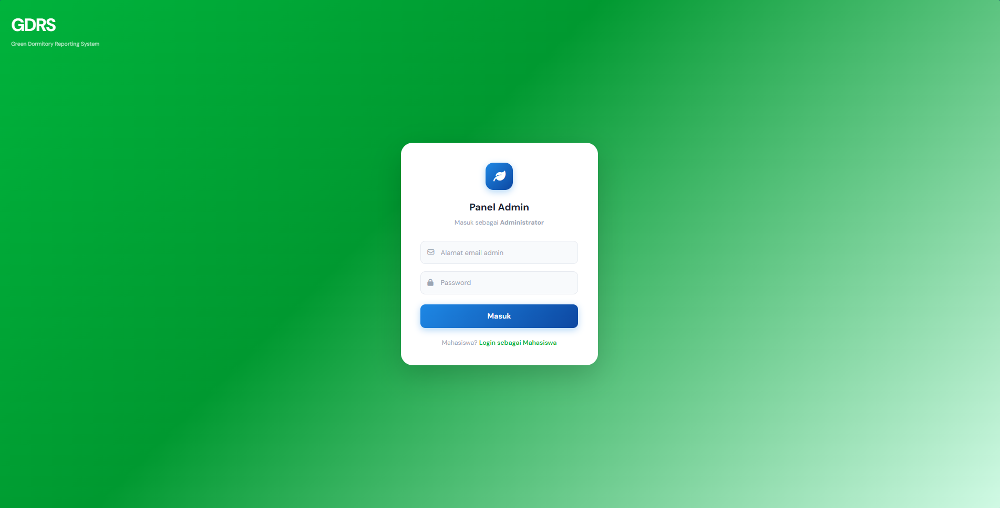
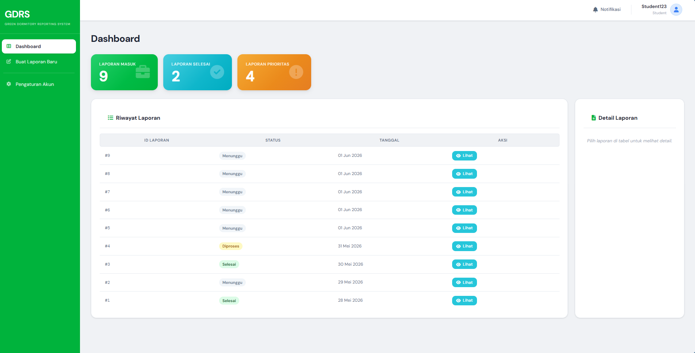
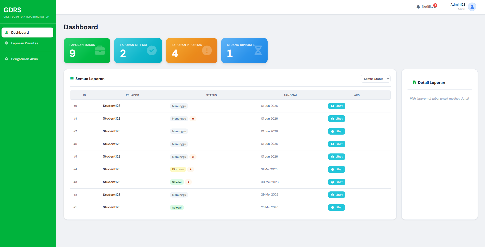
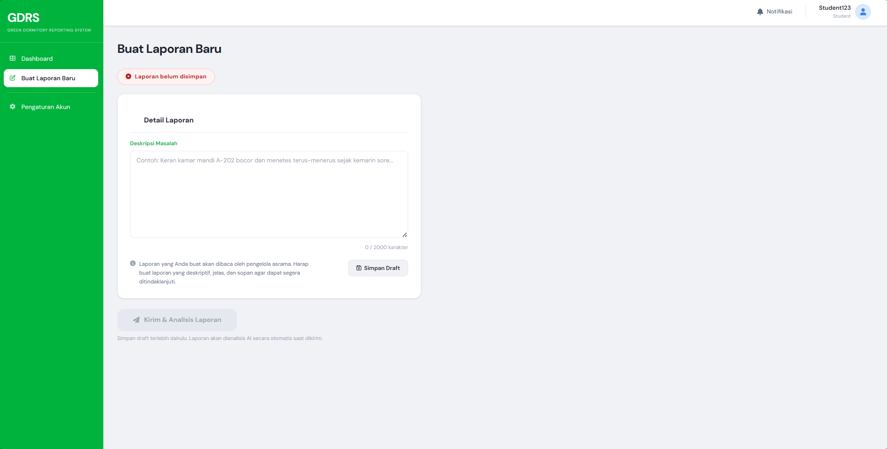
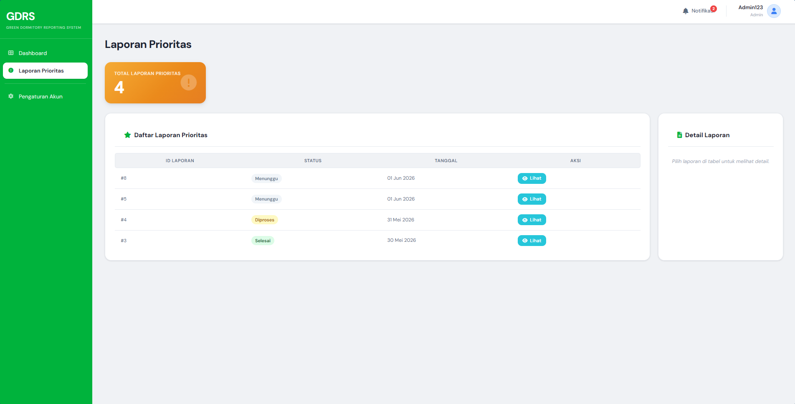
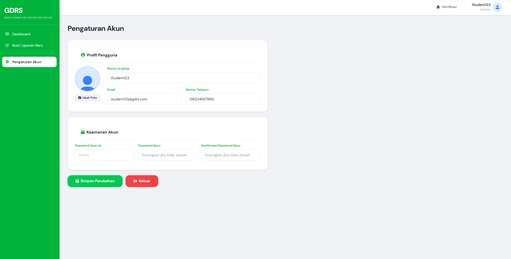

Green Dormitory Reporting System

## Anggota Kelompok
* Syahidah Asma Wardana (M0405241040)
* Aydin Riefky (M0405241041)
* M. Gilbran Firdiansyah (M0405242043)
* Muhammad Bintang Aurel Ramadhan (M0405241045)

## Apa itu GDRS?
GDRS atau Green Dormitory Reporting System adalah sistem pelaporan permasalahan asrama berbasis web yang dilengkapi dengan teknologi kecerdasan buatan untuk mengklasifikasikan tingkat prioritas laporan secara otomatis. Sistem ini diharapkan dapat mempermudah proses pelaporan, membantu pengelola menentukan prioritas penanganan, serta mendukung implementasi konsep Green Campus melalui pengelolaan fasilitas asrama yang lebih efektif dan efisien. Untuk melakukan analisis berbasis AI, digunakan API Gemini 2.5 Flash-lite.

## Tampilan Fitur-fitur
### 1. Login Student

### 2. Login Admin

### 3. Dashboard Student

### 4. Dashboard Admin

### 5. Pembuatan Laporan

### 6. Laporan Prioritas

### 7. Pengaturan Akun  

## Requirements
* DBeaver PostgreSQL
* XAMPP Apache
* Koneksi Internet (untuk estimasi AI)

## Instalasi
### 1. Setup Database
* Install dan lakukan setup DBeaver
* Download PostgreSQL dan lakukan setup (catat password dan port untuk API)
* Buat 'connection' baru di dalam DBeaver yang menggunakan PostgreSQL
* Buat gunakan database yang tersedia atau buat yang baru (perhatikan nama DB harus dalam lowercase)
* Gunakan SQL script pada file "DBeaver_PostgreSQL_DB_Code.sql" untuk menginisialisasi database
* Pastikan semua tabel telah dibuat dan data dummy diisi

### 2. Setup Hosting
* Download XAMPP dan install XAMPP Control Panel
* Aktifkan modul apache
* Periksa dan pastikan folder htdocs berada di C:\xampp\
* Periksa apabila instalasi sukses dengan mengunjungi http://localhost/dashboard/

### 3. Setup File Program
* Masukkan file-file program ke folder htdocs
* Ubah informasi terkait DB (connection, password, schema)

### 4. Setup Gemini AI
* Pergi ke dashboard Google AI Studio dan buat proyek Gemini baru
* Buat dan copy key untuk model AI
* Paste key yang diperoleh ke file API di bagian integrasi AI

### 5. Running
* Pastikan modul Apache di XAMPP Control Panel aktif
* Setelah setup dilakukan buka halaman http://localhost/<filename>/indexstudent.html atau http://localhost/<filename>/indexadmin.html
* Lakukan percobaan login menggunakan akun dummy yang tersedia di DB

### Known Bugs
* Ketika ada kendala pada integrasi AI kadang meng-corrupt koneksi ke DB, masalah ini bisa bertahan pada re-run
* -> Hapus cache browser untuk mengatasinya
